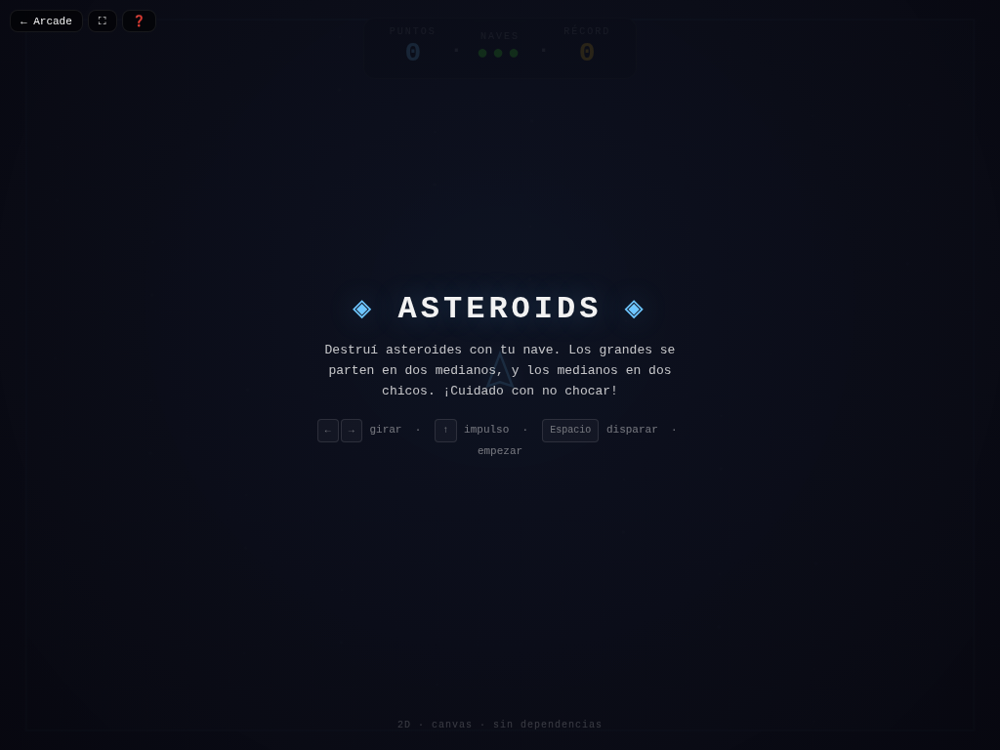

# 🚀 Asteroids

**Versión:** 1.4.0 | **Género:** Space Shooter | **Última actualización:** 2026-07-30

Navegá por el espacio destruyendo asteroides. Los grandes se parten en medianos, los medianos en chicos. ¡A sobrevivir!

## Captura

## Controles

| Dispositivo | Acción                                | Tecla / Control         |
| ----------- | ------------------------------------- | ----------------------- |
| ⌨️ Teclado  | Rotar izquierda                       | `←` / `A`               |
| ⌨️ Teclado  | Rotar derecha                         | `→` / `D`               |
| ⌨️ Teclado  | Acelerar                              | `↑` / `W`               |
| ⌨️ Teclado  | Disparar                              | `Espacio`               |
| ⌨️ Teclado  | Empezar / Reiniciar                   | `R`                     |
| 🎮 Gamepad  | Rotar / Acelerar                      | Stick / D-pad + botones |
| 👆 Táctil   | Botones en pantalla (d-pad + disparo) |                         |

## Características

- 💥 Asteroides que se fragmentan en 2 al destruirse (grande → mediano → chico)
- 🚀 Nave con inercia y wrapping en los bordes
- 🛡️ Invulnerabilidad temporal al perder una vida
- 💥 Game feel: screen shake, hit-stop, squash & stretch, partículas neon en explosiones
- 🏆 Récord persistido en `localStorage`
- ♿ Accesibilidad: anuncios `aria-live`, prefers-reduced-motion
- 🎮 Soporte para teclado, táctil y gamepad

## Detalles técnicos

- Canvas 2D sin dependencias externas
- Game loop con `shared/loop.js` (`createGameLoop` con RAF + dt + cleanup)
- Canvas responsive con `shared/display.js` (`setupCanvas` con DPR + letterboxing + resize debounce)
- HTML compartido inyectado vía `shared/dom.js` (`injectCommonElements`)
- Estilos neon desde `shared/base.css` (overlay, HUD, touch controls, game bar, noise CRT)
- Audio sintetizado con `shared/audio.js` (Web Audio API: beep, ambient drone)
- Game feel: screen shake por trauma, hit-stop, squash & stretch, partículas con object pool (500), `feedbackBundle` por tiers
- Rendimiento: glow sin `shadowBlur` (`drawGlow`), anti-tunneling en sub-pasos (proyectiles), object pooling
- Accesibilidad: `aria-live` announcements, prefers-reduced-motion → `setShakeScale(0)`
- Persistencia en `localStorage` con key namespaced
- 3 modos de entrada: teclado (flechas/WASD + Espacio + R), táctil (botones responsive), gamepad (polling en loop)
