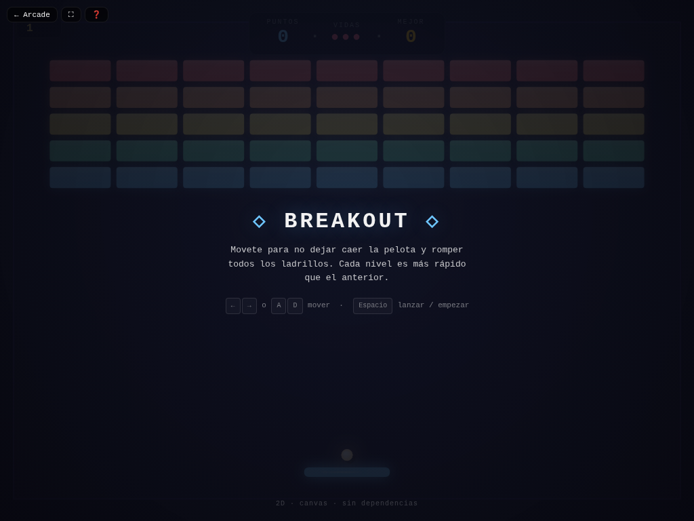

# 🧱 Breakout

**Versión:** 1.5.0 | **Género:** Arcade | **Última actualización:** 2026-07-30

Rompe todos los ladrillos con la pelota. 5 filas de colores, niveles progresivos y récord persistido.

## Captura

## Controles

| Dispositivo | Acción                           | Tecla / Control         |
| ----------- | -------------------------------- | ----------------------- |
| ⌨️ Teclado  | Mover izquierda                  | `←` / `A`               |
| ⌨️ Teclado  | Mover derecha                    | `→` / `D`               |
| ⌨️ Teclado  | Lanzar / Empezar                 | `Espacio`               |
| ⌨️ Teclado  | Reiniciar                        | `R`                     |
| 🎮 Gamepad  | Movimiento                       | Stick izquierdo / D-pad |
| 🎮 Gamepad  | Lanzar                           | Botón A                 |
| 👆 Táctil   | Botones ◀ ▶ + Lanzar en pantalla |                         |

## Características

- 🧱 5 filas de ladrillos con puntajes decrecientes
- ⚡ Velocidad progresiva por nivel
- 💥 Game feel: screen shake, hit-stop, squash & stretch, partículas neon al romper ladrillos
- 🏆 Récord persistido en `localStorage`
- ♿ Accesibilidad: anuncios `aria-live`, prefers-reduced-motion
- 🎮 Soporte para teclado, táctil y gamepad

## Logros

- 🏆 **Rompedor de récords** — Alcanzá 1.000 puntos de récord

## Consejos

- Tratá de mantener la pelota en el centro de la paleta para tener más control de la dirección
- Los ladrillos más altos dan más puntos

## Detalles técnicos

- Canvas 2D sin dependencias externas
- Game loop con `shared/loop.js` (`createGameLoop` con RAF + dt + cleanup)
- Canvas responsive con `shared/display.js` (`setupCanvas` con DPR + letterboxing + resize debounce)
- HTML compartido inyectado vía `shared/dom.js` (`injectCommonElements`)
- Estilos neon desde `shared/base.css` (overlay, HUD, touch controls, game bar, noise CRT)
- Audio sintetizado con `shared/audio.js` (Web Audio API: beep)
- Game feel: screen shake por trauma, hit-stop, squash & stretch, partículas con object pool (500), `feedbackBundle` por tiers
- Rendimiento: glow sin `shadowBlur` (`drawGlow`), anti-tunneling en sub-pasos, object pooling
- Accesibilidad: `aria-live` announcements, `trapTab()` focus trapping, prefers-reduced-motion → `setShakeScale(0)`, modal de ayuda accesible (role=dialog + focus trap), canvas con `role="img"`, zoom móvil habilitado, `:focus-visible` global
- Persistencia en `localStorage` con key namespaced
- 3 modos de entrada: teclado (flechas + Espacio + R), táctil (botones responsive), gamepad (polling en loop)

## Changelog

- **1.5.0** (2026-07-30): Game feel completo — `feedbackBundle()` integrado + squash & stretch + hit-stop; P0: `shadowBlur` eliminado de loops con `drawGlow()`; lint 0 errores/0 warnings
- **1.4.0** (2026-07-30): Migración a `shared/loop.js`; `shimmerFlow` a `base.css`; `drawGlow()` y `feedbackBundle()`; vestigios 3D renombrados (`ball.z, paddle.z → .y`)
- **1.3.0** (2026-07-30): Canvas ID unificado + `setupCanvas()` vía `shared/display.js`; HTML compartido vía `shared/dom.js`
- **1.2.0** (2026-07-28): Refactor CSS a estética neon compartida en `base.css`; README con controles y descripción
- **1.1.0** (2026-07-28): Refactor a carpeta individual; botón ayuda + volver al hub; screen shake y partículas compartidas
- **1.0.0** (2026-06-03): Versión inicial del juego
