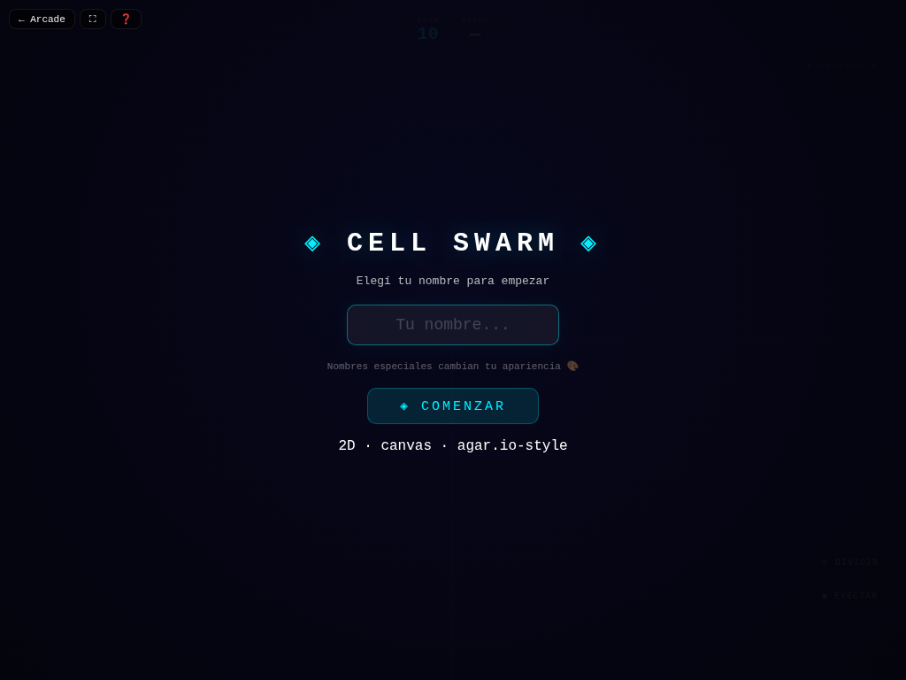

# 🟣 Cell Swarm

**Versión:** 1.3.0 | **Género:** Battle Royale | **Última actualización:** 2026-07-30

Battle royale de células neón. Crece comiendo comida y células más pequeñas, divide tu masa para cazar, eyecta para distraer. ¡Conviértete en la célula más grande del mapa!

## Captura

## Controles

| Dispositivo | Acción            | Tecla / Control     |
| ----------- | ----------------- | ------------------- |
| 🖱️ Mouse    | Moverse           | Mover el cursor     |
| ⌨️ Teclado  | Dividir (Split)   | `Espacio`           |
| ⌨️ Teclado  | Eyectar masa      | `E`                 |
| 🎮 Gamepad  | Moverse           | Stick izquierdo     |
| 🎮 Gamepad  | Dividir           | Botón A             |
| 🎮 Gamepad  | Eyectar           | Botón B             |
| 👆 Táctil   | Moverse           | Deslizar el dedo    |
| 👆 Táctil   | Dividir / Eyectar | Botones en pantalla |

## Características

- 🌍 Mapa amplio de 5000×5000 con cámara dinámica
- 🤖 20 bots con IA avanzada (5 personalidades: agresivo, tímido, equilibrado, cazador, cobarde)
- 🧬 Esquiva de proyectiles (bots huyen de splits enemigos)
- ✂️ Split: divide tu célula en 2 para atrapar presas rápidas
- 💨 Eyectar: dispara masa para distraer o alimentar
- 🏆 Ranking en tiempo real de las 10 células más grandes
- 🎨 Skins especiales: banderas de países, emojis, degradados
- 💥 Game feel: screen shake, hit-stop, partículas neon al dividir y absorber
- 🏆 Récord de masa persistido en `localStorage`
- ♿ Accesibilidad: anuncios `aria-live`, prefers-reduced-motion
- 🎮 Soporte para mouse, teclado, táctil y gamepad

## Detalles técnicos

- Canvas 2D sin dependencias externas
- Game loop con `shared/loop.js` (`createGameLoop` con RAF + dt + cleanup)
- Canvas responsive con `shared/display.js` (`setupCanvas` con DPR + letterboxing + resize debounce)
- HTML compartido inyectado vía `shared/dom.js` (`injectCommonElements`)
- Estilos neon desde `shared/base.css` (overlay, HUD, touch controls, game bar, noise CRT)
- Audio sintetizado con `shared/audio.js` (Web Audio API: beep, ambient drone)
- Game feel: screen shake por trauma, hit-stop, squash & stretch, partículas con object pool (500), `feedbackBundle` por tiers
- Rendimiento: glow sin `shadowBlur` (`drawGlow`), object pooling
- Accesibilidad: `aria-live` announcements, prefers-reduced-motion → `setShakeScale(0)`
- Persistencia en `localStorage` con key namespaced
- 4 modos de entrada: mouse, teclado (Espacio + E), táctil (deslizar + botones), gamepad (polling en loop)
