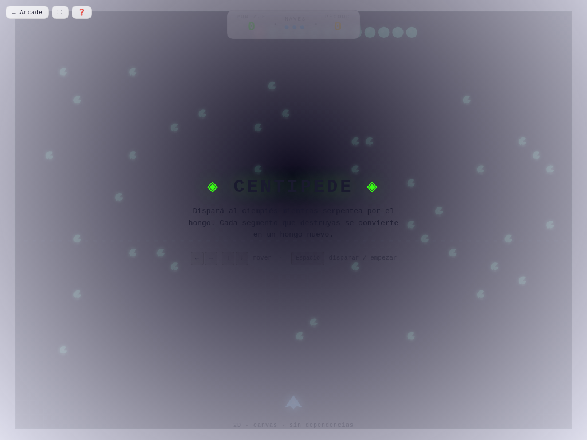

# 🐛 Centipede

**Versión:** 1.4.0 | **Género:** Arcade | **Última actualización:** 2026-07-30

Dispará al ciempiés mientras serpentea entre hongos. Cada segmento que destruyas se convierte en un hongo nuevo. ¡Cuidado con la araña saltarina, las pulgas y los escorpiones!

## Captura

## Controles

| Dispositivo | Acción              | Tecla / Control       |
| ----------- | ------------------- | --------------------- |
| ⌨️ Teclado  | Mover               | `← → ↑ ↓` / `W A S D` |
| ⌨️ Teclado  | Disparar            | `Espacio`             |
| ⌨️ Teclado  | Empezar / Reiniciar | `R`                   |
| 🎮 Gamepad  | Movimiento          | Stick izquierdo       |
| 🎮 Gamepad  | Disparar            | Botón A               |
| 👆 Táctil   | Botones en pantalla |                       |

## Características

- 🐛 Ciempiés que serpentea y se divide al ser disparado
- 🍄 Hongos que crecen con cada impacto
- 🕷️ Araña saltarina que rebota en los bordes
- 🪰 Pulgas que caen del cielo dejando hongos
- 🦂 Escorpiones que envenenan hongos
- 💥 Game feel: screen shake, hit-stop, partículas neon en impactos
- 🏆 Récord persistido en `localStorage`
- ♿ Accesibilidad: anuncios `aria-live`, prefers-reduced-motion
- 🎮 Soporte para teclado, táctil y gamepad

## Detalles técnicos

- Canvas 2D sin dependencias externas
- Game loop con `shared/loop.js` (`createGameLoop` con RAF + dt + cleanup)
- Canvas responsive con `shared/display.js` (`setupCanvas` con DPR + letterboxing + resize debounce)
- HTML compartido inyectado vía `shared/dom.js` (`injectCommonElements`)
- Estilos neon desde `shared/base.css` (overlay, HUD, touch controls, game bar, noise CRT)
- Audio sintetizado con `shared/audio.js` (Web Audio API: beep, ambient drone)
- Game feel: screen shake por trauma, hit-stop, squash & stretch, partículas con object pool (500), `feedbackBundle` por tiers
- Rendimiento: glow sin `shadowBlur` (`drawGlow`), anti-tunneling en sub-pasos, object pooling
- Accesibilidad: `aria-live` announcements, prefers-reduced-motion → `setShakeScale(0)`
- Persistencia en `localStorage` con key namespaced
- 3 modos de entrada: teclado (flechas/WASD + Espacio + R), táctil (botones responsive), gamepad (polling en loop)
