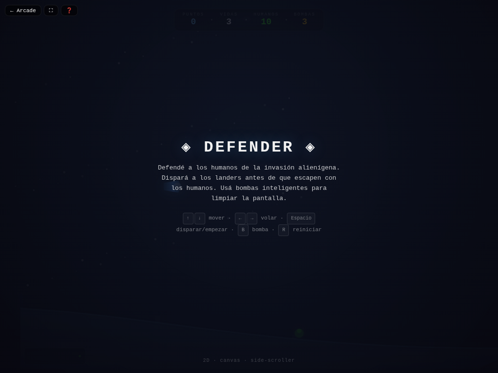

# 🚀 Defender

**Versión:** 1.0.0 | **Género:** Shooter | **Última actualización:** 2026-07-28

Side-scrolling shooter clásico. Defendé a los humanos de la invasión alienígena en un mundo que se desplaza horizontalmente.

## Captura

## Controles

| Dispositivo | Acción | Tecla / Control |
|-------------|--------|-----------------|
| ⌨️ Teclado | Movimiento | `↑ ↓ ← →` / `W A S D` |
| ⌨️ Teclado | Disparar | `Espacio` |
| ⌨️ Teclado | Bomba inteligente | `B` |
| ⌨️ Teclado | Empezar / Reiniciar | `Espacio` / `R` |
| 🎮 Gamepad | Movimiento | Stick izquierdo / D-pad |
| 🎮 Gamepad | Disparar | Botón A |
| 🎮 Gamepad | Bomba | Botón B |
| 👆 Táctil | D-pad + botones en pantalla (visible en móvil) | |

## Características

- 🏔️ Terreno procedural con montañas que se desplazan
- 👽 3 tipos de enemigos: Landers (secuestran humanos), Bombers (lanzan bombas), Mutantes (persecución)
- 👨‍👩‍👧‍👧 10 humanos para defender repartidos por el mundo
- 💣 Bombas inteligentes que limpian la pantalla
- 📡 Mini-radar en pantalla para localizar enemigos y humanos
- 🪂 Humanos rescatados caen en paracaídas
- 🔫 Sistema de puntuación progresivo con niveles
- 🎮 Soporte para teclado, táctil y gamepad

## Detalles técnicos

- Canvas 2D sin dependencias externas
- Mundo de 6000px de ancho con scroll horizontal
- Cámara que sigue al jugador con suavizado
- Módulos compartidos: `audio.js`, `effects.js`, `achievements.js`
