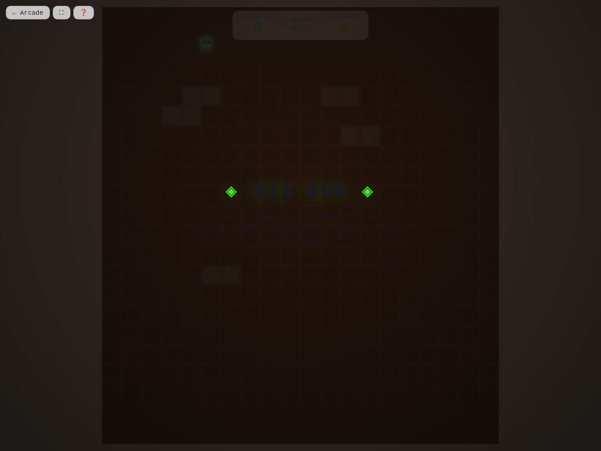

# ⛏️ Dig Dug

**Versión:** 1.4.0 | **Género:** Arcade | **Última actualización:** 2026-07-30

Excavá túneles en la tierra, inflá a los enemigos hasta que exploten o derrumbá rocas sobre ellos. Dos tipos de enemigos con IA propia.

## Captura

## Controles

| Dispositivo | Acción              | Tecla / Control       |
| ----------- | ------------------- | --------------------- |
| ⌨️ Teclado  | Mover               | `↑ ↓ ← →` / `W A S D` |
| ⌨️ Teclado  | Inflar / Bomba      | `Espacio`             |
| ⌨️ Teclado  | Empezar / Reiniciar | `R`                   |
| 🎮 Gamepad  | Movimiento          | D-pad / Stick         |
| 🎮 Gamepad  | Acción              | Botón A               |
| 👆 Táctil   | Botones en pantalla |                       |

## Características

- ⛏️ Sistema de excavación de túneles en terreno sólido
- 🎈 Inflar enemigos hasta que exploten
- 🪨 Rocas que caen y aplastan enemigos
- 👾 Dos tipos de enemigos: Pooka (redondo) y Fygar (dragón)
- 💥 Game feel: screen shake, hit-stop, partículas neon al inflar y explotar
- 🏆 Récord persistido en `localStorage`
- ♿ Accesibilidad: anuncios `aria-live`, prefers-reduced-motion
- 🎮 Soporte para teclado, táctil y gamepad

## Logros

- 🏆 **Excavador experto** — Alcanzá 1.000 puntos de récord

## Detalles técnicos

- Canvas 2D sin dependencias externas
- Game loop con `shared/loop.js` (`createGameLoop` con RAF + dt + cleanup)
- Canvas responsive con `shared/display.js` (`setupCanvas` con DPR + letterboxing + resize debounce)
- HTML compartido inyectado vía `shared/dom.js` (`injectCommonElements`)
- Estilos neon desde `shared/base.css` (overlay, HUD, touch controls, game bar, noise CRT)
- Audio sintetizado con `shared/audio.js` (Web Audio API: beep, ambient drone)
- Game feel: screen shake por trauma, hit-stop, squash & stretch, partículas con object pool (500), `feedbackBundle` por tiers
- Rendimiento: glow sin `shadowBlur` (`drawGlow`), object pooling
- Accesibilidad: `aria-live` announcements, `trapTab()` focus trapping, prefers-reduced-motion → `setShakeScale(0)`, modal de ayuda accesible (role=dialog + focus trap), canvas con `role="img"`, zoom móvil habilitado, `:focus-visible` global
- Persistencia en `localStorage` con key namespaced
- 3 modos de entrada: teclado (flechas/WASD + Espacio + R), táctil (botones responsive), gamepad (polling en loop)

## Changelog

- **1.4.0** (2026-07-30): Game feel completo — `feedbackBundle()` integrado + squash & stretch + hit-stop; P0: `shadowBlur` eliminado de loops con `drawGlow()`; lint 0 errores/0 warnings
- **1.3.0** (2026-07-30): Migración a `shared/loop.js`; `shimmerFlow` a `base.css`; `drawGlow()` y `feedbackBundle()`
- **1.2.0** (2026-07-30): Canvas ID unificado + `setupCanvas()` vía `shared/display.js`; HUD IDs legibles; HTML compartido vía `shared/dom.js`
- **1.1.0** (2026-07-28): Refactor CSS a estética neon compartida en `base.css`; README con controles y descripción; correcciones ESLint
- **1.0.0** (2026-07-25): Versión inicial del juego
