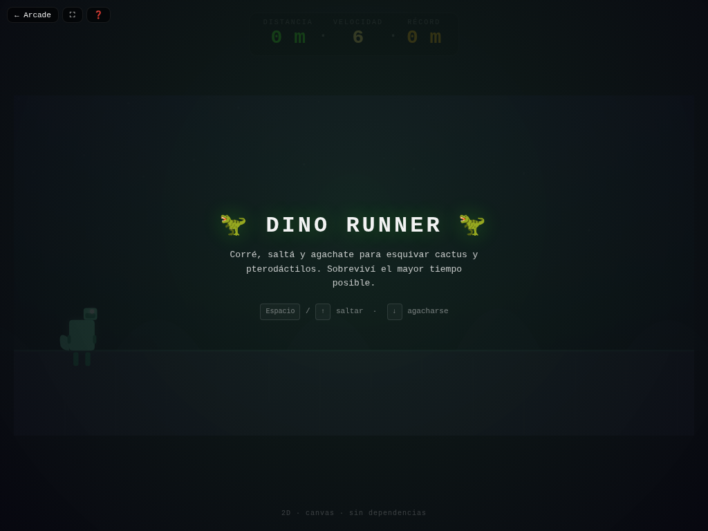

# 🦖 Dino Runner

**Versión:** 1.1.0 | **Género:** Plataformas | **Última actualización:** 2026-07-28

Corré, saltá y agachate para esquivar cactus y pterodáctilos. La velocidad aumenta con el tiempo. ¿Cuánto podés durar?

## Captura

## Controles

| Dispositivo | Acción | Tecla / Control |
|-------------|--------|-----------------|
| ⌨️ Teclado | Saltar | `Espacio` / `↑` |
| ⌨️ Teclado | Agacharse | `↓` |
| ⌨️ Teclado | Empezar | `Espacio` / `R` |
| 🎮 Gamepad | Saltar | Botón A / X |
| 🎮 Gamepad | Agacharse | Botón B / stick abajo |
| 👆 Táctil | Botones Saltar y Agacharse en pantalla | |

## Características

- 🏃‍♂️ Velocidad progresiva con el tiempo
- 🌵 Cactus de distintos tamaños y clusters
- 🦅 Pterodáctilos a partir de cierta distancia
- 🏆 Récord persistido en `localStorage`
- 🌓 Soporte de tema claro/oscuro
- 🎮 Soporte para teclado, táctil y gamepad

## Consejos

- Agacharse solo funciona en el suelo (no en el aire)
- La velocidad máxima se alcanza gradualmente
