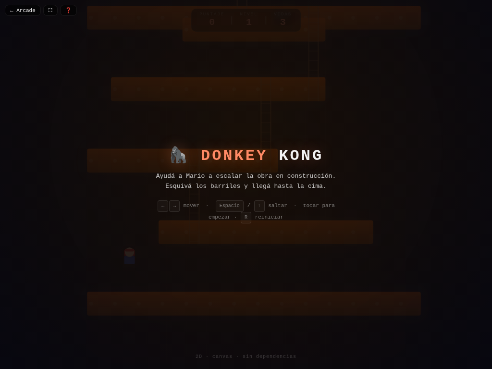

# 🦍 Donkey Kong

**Versión:** 1.2.0 | **Género:** Plataformas | **Última actualización:** 2026-07-30

Ayudá a Mario a escalar la obra en construcción. Esquivá los barriles que lanza Donkey Kong, subí por las escaleras y llegá hasta la cima.

## Captura

## Controles

| Dispositivo | Acción                                       | Tecla / Control         |
| ----------- | -------------------------------------------- | ----------------------- |
| ⌨️ Teclado  | Mover izquierda                              | `←` / `A`               |
| ⌨️ Teclado  | Mover derecha                                | `→` / `D`               |
| ⌨️ Teclado  | Saltar                                       | `Espacio` / `↑` / `W`   |
| ⌨️ Teclado  | Reiniciar                                    | `R`                     |
| 🎮 Gamepad  | Movimiento                                   | Stick izquierdo / D-pad |
| 🎮 Gamepad  | Saltar                                       | Botón A                 |
| 👆 Táctil   | Botones ◀ ▲ ▶ en pantalla (visible en móvil) |                         |

## Características

- 🦍 Donkey Kong en la cima lanzando barriles
- 🪜 4 niveles de plataformas con escaleras
- ⏱️ Temporizador por nivel (60 segundos)
- 💥 Game feel: screen shake, hit-stop, squash & stretch, partículas neon al saltar y al morir
- 🏆 Puntaje y vidas persistidos
- ♿ Accesibilidad: anuncios `aria-live`, prefers-reduced-motion
- 🌓 Soporte de tema claro/oscuro
- 🎮 Soporte para teclado, táctil y gamepad

## Detalles técnicos

- Canvas 2D sin dependencias externas
- Game loop con `shared/loop.js` (`createGameLoop` con RAF + dt + cleanup)
- Canvas responsive con `shared/display.js` (`setupCanvas` con DPR + letterboxing + resize debounce)
- HTML compartido inyectado vía `shared/dom.js` (`injectCommonElements`)
- Estilos neon desde `shared/base.css` (overlay, HUD, touch controls, game bar, noise CRT)
- Audio sintetizado con `shared/audio.js` (Web Audio API: beep, ambient drone)
- Game feel: screen shake por trauma, hit-stop, squash & stretch, partículas con object pool (500), `feedbackBundle` por tiers
- Rendimiento: glow sin `shadowBlur` (`drawGlow`), object pooling
- Física: coyote time + jump buffering para salto responsive
- Accesibilidad: `aria-live` announcements, prefers-reduced-motion → `setShakeScale(0)`
- Persistencia en `localStorage` con key namespaced
- 3 modos de entrada: teclado (flechas/WASD + Espacio + R), táctil (botones responsive), gamepad (polling en loop)
