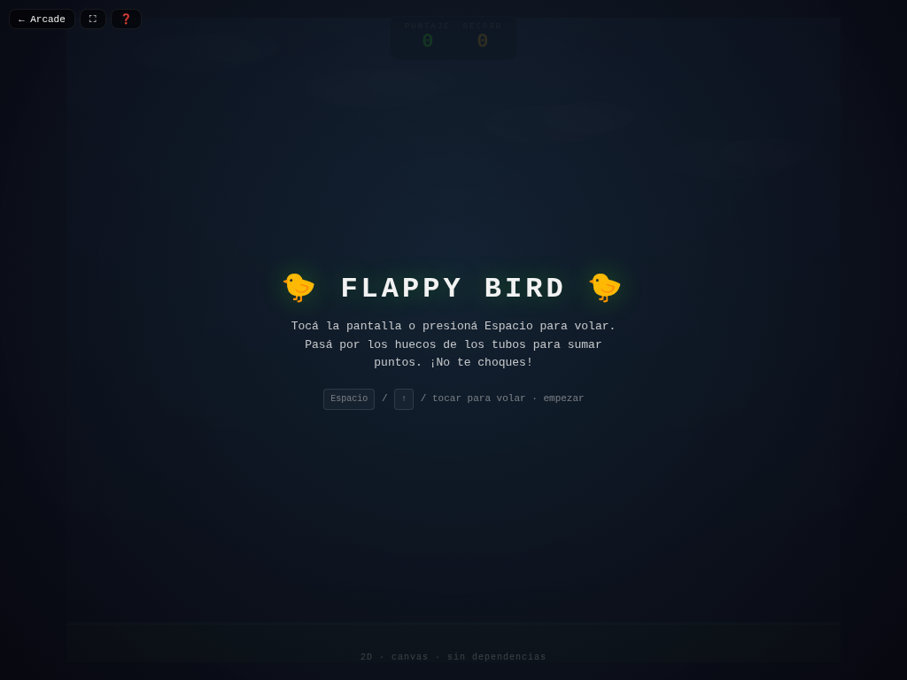

# 🐤 Flappy Bird

**Versión:** 1.4.0 | **Género:** Arcade | **Última actualización:** 2026-07-30

Volá esquivando tubos. Tocá la pantalla o presioná Espacio para aletear. ¡A ver cuánto durás!

## Captura

## Controles

| Dispositivo | Acción                                | Tecla / Control |
| ----------- | ------------------------------------- | --------------- |
| ⌨️ Teclado  | Aletear                               | `Espacio` / `↑` |
| ⌨️ Teclado  | Empezar / Reiniciar                   | `Espacio` / `R` |
| 🎮 Gamepad  | Aletear                               | Botón A         |
| 👆 Táctil   | Tocar la pantalla / Botón en pantalla |                 |

## Características

- 🐤 Física de aleteo con rotación del pájaro según velocidad
- 🏗️ Tubos con espaciado variable
- 💥 Game feel: screen shake, hit-stop, partículas neon al aletear y al chocar
- 🏆 Récord persistido en `localStorage`
- ♿ Accesibilidad: anuncios `aria-live`, prefers-reduced-motion
- 🎮 Soporte para teclado, táctil y gamepad

## Consejos

- Aleteá con ritmo constante, no en ráfagas
- Mirá el espacio entre tubos, no el pájaro

## Detalles técnicos

- Canvas 2D sin dependencias externas
- Game loop con `shared/loop.js` (`createGameLoop` con RAF + dt + cleanup)
- Canvas responsive con `shared/display.js` (`setupCanvas` con DPR + letterboxing + resize debounce)
- HTML compartido inyectado vía `shared/dom.js` (`injectCommonElements`)
- Estilos neon desde `shared/base.css` (overlay, HUD, touch controls, game bar, noise CRT)
- Audio sintetizado con `shared/audio.js` (Web Audio API: beep)
- Game feel: screen shake por trauma, hit-stop, squash & stretch, partículas con object pool (500), `feedbackBundle` por tiers
- Rendimiento: glow sin `shadowBlur` (`drawGlow`), object pooling
- Accesibilidad: `aria-live` announcements, prefers-reduced-motion → `setShakeScale(0)`
- Persistencia en `localStorage` con key namespaced
- 3 modos de entrada: teclado (Espacio/↑ + R), táctil (tap), gamepad (botón A)
