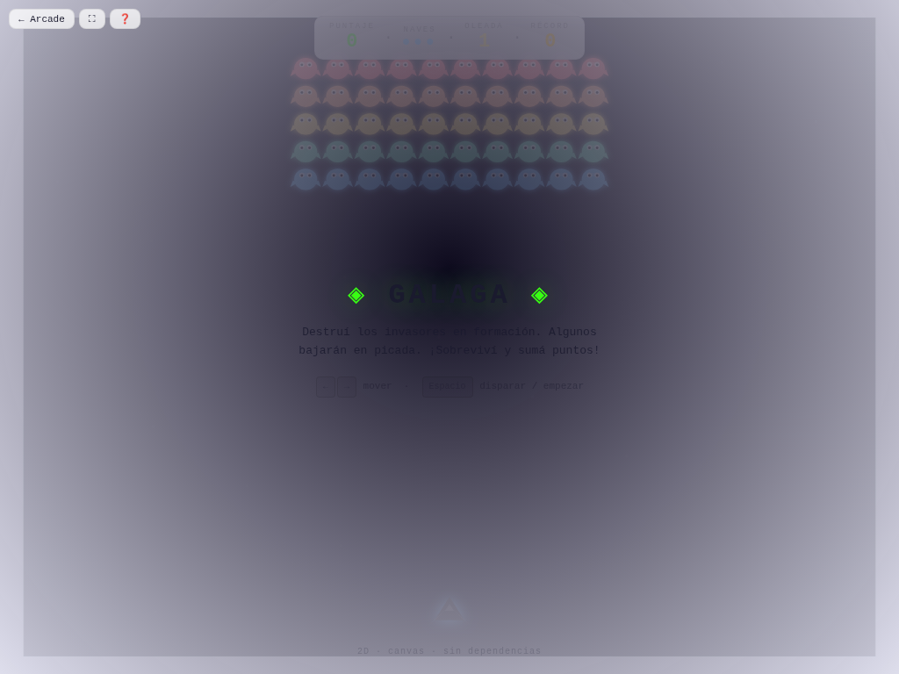

# 🛸 Galaga

**Versión:** 1.4.0 | **Género:** Space Shooter | **Última actualización:** 2026-07-30

Destruí oleadas de invasores en formación. Esquivá sus picados en espiral y sobreviví el mayor tiempo posible.

## Captura

## Controles

| Dispositivo | Acción                              | Tecla / Control |
| ----------- | ----------------------------------- | --------------- |
| ⌨️ Teclado  | Mover izquierda                     | `←` / `A`       |
| ⌨️ Teclado  | Mover derecha                       | `→` / `D`       |
| ⌨️ Teclado  | Disparar                            | `Espacio`       |
| ⌨️ Teclado  | Empezar / Reiniciar                 | `Espacio` / `R` |
| 🎮 Gamepad  | Movimiento                          | Stick / D-pad   |
| 🎮 Gamepad  | Disparar                            | Botón A         |
| 👆 Táctil   | Botones en pantalla (◀ ▶ + disparo) |                 |

## Características

- 👾 Invasores con formación que realiza picados en espiral
- 💥 Game feel: screen shake, hit-stop, squash & stretch, partículas neon en explosiones
- ⚡ Velocidad de oleadas progresiva
- 🏆 Récord persistido en `localStorage`
- ♿ Accesibilidad: anuncios `aria-live`, prefers-reduced-motion
- 🎮 Soporte para teclado, táctil y gamepad

## Detalles técnicos

- Canvas 2D sin dependencias externas
- Game loop con `shared/loop.js` (`createGameLoop` con RAF + dt + cleanup)
- Canvas responsive con `shared/display.js` (`setupCanvas` con DPR + letterboxing + resize debounce)
- HTML compartido inyectado vía `shared/dom.js` (`injectCommonElements`)
- Estilos neon desde `shared/base.css` (overlay, HUD, touch controls, game bar, noise CRT)
- Audio sintetizado con `shared/audio.js` (Web Audio API: beep, ambient drone)
- Game feel: screen shake por trauma, hit-stop, squash & stretch, partículas con object pool (500), `feedbackBundle` por tiers
- Rendimiento: glow sin `shadowBlur` (`drawGlow`), anti-tunneling en sub-pasos, object pooling
- Accesibilidad: `aria-live` announcements, prefers-reduced-motion → `setShakeScale(0)`
- Persistencia en `localStorage` con key namespaced
- 3 modos de entrada: teclado (flechas + Espacio + R), táctil (botones responsive), gamepad (polling en loop)
