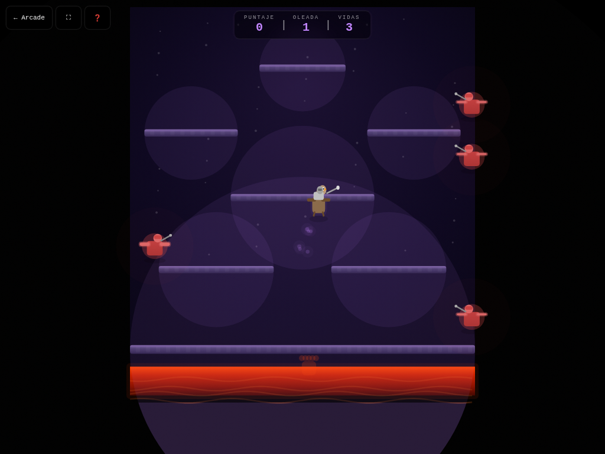

# 🦅 Joust

**Versión:** 1.3.0 | **Género:** Acción | **Última actualización:** 2026-07-30

Montá tu avestruz y derrotá a los jinetes enemigos en justas aéreas clásicas. Golpeá desde arriba para vencer, recolectá huevos para puntos extra y sobreviví oleadas cada vez más difíciles.

## Captura

## Controles

| Dispositivo | Acción                                 | Tecla / Control         |
| ----------- | -------------------------------------- | ----------------------- |
| ⌨️ Teclado  | Mover izquierda                        | `←` / `A`               |
| ⌨️ Teclado  | Mover derecha                          | `→` / `D`               |
| ⌨️ Teclado  | Aletear / Ascender                     | `Espacio` / `↑` / `W`   |
| ⌨️ Teclado  | Reiniciar                              | `R`                     |
| 🎮 Gamepad  | Movimiento                             | Stick izquierdo / D-pad |
| 🎮 Gamepad  | Aletear                                | Botón A                 |
| 👆 Táctil   | Botones en pantalla (visible en móvil) |                         |

## Características

- 🦅 Física de aleteo con inercia horizontal y gravedad
- ⚔️ Justas aéreas: golpeá desde arriba para eliminar enemigos
- 👾 3 tipos de enemigos: Bounders, Hunters y Shadow Lords
- 🥚 Huevos que rebotan en plataformas y eclosionan si no los recolectás
- 🌋 Lago de lava en la base con mano troll que atrapa
- 📈 Oleadas progresivas con dificultad creciente
- 💥 Game feel: screen shake, hit-stop, squash & stretch, partículas neon en colisiones
- 🏆 Puntaje y récord persistidos
- ♿ Accesibilidad: anuncios `aria-live`, prefers-reduced-motion
- 🎮 Soporte para teclado, táctil y gamepad

## Logros

- 🏆 **Primera justa** — Ganá tu primera justa aérea
- 🏆 **Cazador de huevos** — Recolectá 10 huevos
- 🏆 **Invencible** — Sobreviví hasta la oleada 5

## Detalles técnicos

- Canvas 2D sin dependencias externas
- Game loop con `shared/loop.js` (`createGameLoop` con RAF + dt + cleanup)
- Canvas responsive con `shared/display.js` (`setupCanvas` con DPR + letterboxing + resize debounce)
- HTML compartido inyectado vía `shared/dom.js` (`injectCommonElements`)
- Estilos neon desde `shared/base.css` (overlay, HUD, touch controls, game bar, noise CRT)
- Audio sintetizado con `shared/audio.js` (Web Audio API: beep, ambient drone)
- Game feel: screen shake por trauma, hit-stop, squash & stretch, partículas con object pool (500), `feedbackBundle` por tiers
- Rendimiento: glow sin `shadowBlur` (`drawGlow`), anti-tunneling en sub-pasos, object pooling
- Accesibilidad: `aria-live` announcements, `trapTab()` focus trapping, prefers-reduced-motion → `setShakeScale(0)`, modal de ayuda accesible (role=dialog + focus trap), canvas con `role="img"`, zoom móvil habilitado, `:focus-visible` global
- Persistencia en `localStorage` con key namespaced
- 3 modos de entrada: teclado (flechas/WASD + Espacio + R), táctil (botones responsive), gamepad (polling en loop)

## Changelog

- **1.3.0** (2026-07-30): Game feel completo — `feedbackBundle()` integrado + squash & stretch + hit-stop; P0: `shadowBlur` eliminado de loops con `drawGlow()`; lint 0 errores/0 warnings
- **1.2.0** (2026-07-30): Migración a `shared/loop.js`; `shimmerFlow` a `base.css`; `drawGlow()` y `feedbackBundle()`
- **1.1.0** (2026-07-30): Canvas ID unificado + `setupCanvas()` vía `shared/display.js`; HTML compartido vía `shared/dom.js`
- **1.0.0** (2026-07-29): Versión inicial del juego — física de aleteo, 3 tipos de enemigos, mecánica de justas, huevos rebotando, oleadas progresivas, 3 modos de entrada
