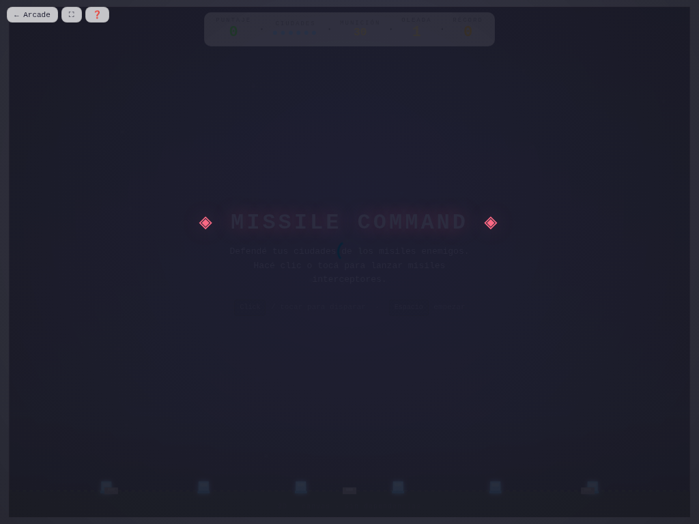

# 🚀 Missile Command

**Versión:** 1.4.0 | **Género:** Defensa | **Última actualización:** 2026-07-30

Defendé tus ciudades de misiles enemigos. Apuntá con el mouse o el stick y dispará interceptores. Misiles inteligentes y satélites desde la oleada 2.

## Captura

## Controles

| Dispositivo | Acción              | Tecla / Control           |
| ----------- | ------------------- | ------------------------- |
| 🖱️ Mouse    | Apuntar             | Mover el cursor           |
| 🖱️ Mouse    | Disparar            | Click izquierdo / Espacio |
| ⌨️ Teclado  | Empezar / Reiniciar | `Espacio` / `R`           |
| 🕹️ Gamepad  | Apuntar             | Stick izquierdo           |
| 🕹️ Gamepad  | Disparar            | Botón A / X               |
| 👆 Táctil   | Apuntar y disparar  | Tocar la pantalla         |

## Características

- 🚀 Misiles enemigos con estela, desde 3 direcciones
- 💥 Interceptores con explosión de área (daña misiles cercanos)
- 🏙️ 6 ciudades para defender
- 🎯 Misiles inteligentes que cambian de dirección (oleada 2+)
- 🛰️ Satélites que lanzan múltiples misiles (oleada 2+)
- 💥 Game feel: screen shake, hit-stop, partículas neon en explosiones
- 🏆 Récord persistido en `localStorage`
- ♿ Accesibilidad: anuncios `aria-live`, prefers-reduced-motion
- 🎮 Soporte para mouse, teclado, gamepad y táctil

## Logros

- 🏆 **Defensor de la humanidad** — Alcanzá 1.000 puntos en una partida

## Detalles técnicos

- Canvas 2D sin dependencias externas
- Game loop con `shared/loop.js` (`createGameLoop` con RAF + dt + cleanup)
- Canvas responsive con `shared/display.js` (`setupCanvas` con DPR + letterboxing + resize debounce)
- HTML compartido inyectado vía `shared/dom.js` (`injectCommonElements`)
- Estilos neon desde `shared/base.css` (overlay, HUD, touch controls, game bar, noise CRT)
- Audio sintetizado con `shared/audio.js` (Web Audio API: beep, ambient drone)
- Game feel: screen shake por trauma, hit-stop, squash & stretch, partículas con object pool (500), `feedbackBundle` por tiers
- Rendimiento: glow sin `shadowBlur` (`drawGlow`), object pooling
- Accesibilidad: `aria-live` announcements, `trapTab()` focus trapping, prefers-reduced-motion → `setShakeScale(0)`, modal de ayuda accesible (role=dialog + focus trap), canvas con `role="img"`, zoom móvil habilitado, `:focus-visible` global
- Persistencia en `localStorage` con key namespaced
- 4 modos de entrada: mouse, teclado (flechas + Espacio + R), táctil (tap), gamepad (polling en loop)

## Changelog

- **1.4.0** (2026-07-30): Game feel completo — `feedbackBundle()` integrado + squash & stretch + hit-stop; P0: `shadowBlur` eliminado de loops con `drawGlow()`; lint 0 errores/0 warnings; R3: constantes extraídas (ammo, intervalos de oleadas); fix refs rotas
- **1.3.0** (2026-07-30): Migración a `shared/loop.js`; `shimmerFlow` a `base.css`; `drawGlow()` y `feedbackBundle()`
- **1.2.0** (2026-07-30): Canvas ID unificado + `setupCanvas()` vía `shared/display.js`; HUD IDs legibles; HTML compartido vía `shared/dom.js`
- **1.1.0** (2026-07-28): Refactor CSS a estética neon compartida en `base.css`; README con controles y descripción; correcciones ESLint
- **1.0.0** (2026-07-28): Versión inicial del juego
