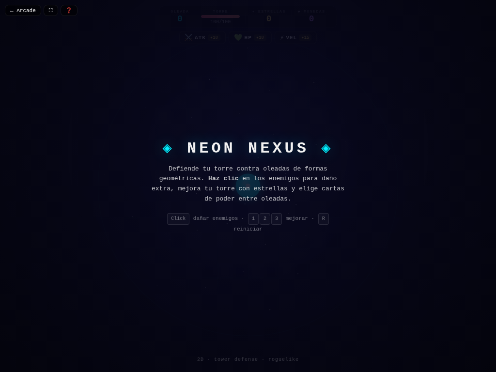

# ◈ Neon Nexus

**Versión:** 1.4.0 | **Género:** Tower Defense Roguelike | **Última actualización:** 2026-07-30

Defiende tu torre geométrica contra oleadas de formas neon. La torre dispara automáticamente, haz clic para daño extra, mejora con estrellas y elige cartas de poder entre oleadas.

## Captura

## Controles

| Dispositivo          | Acción                                  | Tecla / Control       |
| -------------------- | --------------------------------------- | --------------------- |
| 🖱️ Mouse / 👆 Táctil | Click de daño extra                     | Click / Tap en canvas |
| ⌨️ Teclado           | Mejorar ATK                             | `1`                   |
| ⌨️ Teclado           | Mejorar HP                              | `2`                   |
| ⌨️ Teclado           | Mejorar Velocidad                       | `3`                   |
| ⌨️ Teclado           | Empezar / Reiniciar                     | `Espacio` / `R`       |
| ⌨️ Teclado           | Tienda (tras game over)                 | `T`                   |
| 🎮 Gamepad           | Click daño                              | Botón A               |
| 🎮 Gamepad           | Empezar                                 | Start                 |
| 👆 Táctil            | Botones de mejora + disparo en pantalla |                       |

## Características

- 🗼 Torre que dispara automáticamente a los enemigos
- 🃏 Sistema de cartas roguelike entre oleadas (15 cartas únicas)
- ⭐ Mejoras en tiempo real (ATK, HP, Velocidad) con estrellas
- 🏪 Tienda permanente con mejoras entre runs
- 🔄 Combinaciones de cartas: Cadena, Vampirismo, Multishot, Explosión, Escudo, Drenar, Torreta, Ralentización Global y más
- 💥 Game feel: screen shake, hit-stop, partículas neon en impactos y kills
- 🏆 Récord de oleada persistido en `localStorage`
- ♿ Accesibilidad: anuncios `aria-live`, prefers-reduced-motion
- 🎮 Soporte para mouse, teclado, táctil y gamepad

## Detalles técnicos

- Canvas 2D sin dependencias externas
- Game loop con `shared/loop.js` (`createGameLoop` con RAF + dt + cleanup)
- Canvas responsive con `shared/display.js` (`setupCanvas` con DPR + letterboxing + resize debounce)
- HTML compartido inyectado vía `shared/dom.js` (`injectCommonElements`)
- Estilos neon desde `shared/base.css` (overlay, HUD, touch controls, game bar, noise CRT)
- Audio sintetizado con `shared/audio.js` (Web Audio API: beep, ambient drone)
- Game feel: screen shake por trauma, hit-stop, squash & stretch, partículas con object pool (500), `feedbackBundle` por tiers
- Rendimiento: glow sin `shadowBlur` (`drawGlow`), anti-tunneling en sub-pasos, object pooling
- Accesibilidad: `aria-live` announcements, `trapTab()` focus trapping, prefers-reduced-motion → `setShakeScale(0)`, modal de ayuda accesible (role=dialog + focus trap), canvas con `role="img"`, zoom móvil habilitado, `:focus-visible` global
- Persistencia en `localStorage` con key namespaced (`neonNexus_coins`, `neonNexus_best`)
- 4 modos de entrada: mouse/click, teclado (1/2/3 + Espacio + R + T), táctil (tap + botones), gamepad (polling en loop)

## Changelog

- **1.4.0** (2026-07-30): Game feel completo — `feedbackBundle()` integrado + squash & stretch + hit-stop; P0: `shadowBlur` eliminado de loops con `drawGlow()`; lint 0 errores/0 warnings; R3: constantes extraídas (spawn, escudo, upgrades); fix `injectCommonElements()` restaurado
- **1.3.0** (2026-07-30): Migración a `shared/loop.js`; `shimmerFlow` a `base.css`; `drawGlow()` y `feedbackBundle()`
- **1.2.0** (2026-07-30): Canvas ID unificado + `setupCanvas()` vía `shared/display.js`; HTML compartido vía `shared/dom.js`
- **1.1.0** (2026-07-28): Refactor CSS a estética neon compartida en `base.css`; README con controles y descripción; nuevas cartas (Drenar, Torreta Auxiliar, Escudo Regenerativo, Ralentización Global); balance de oleadas; fix botón de ayuda
- **1.0.0** (2026-07-28): Versión inicial del juego
