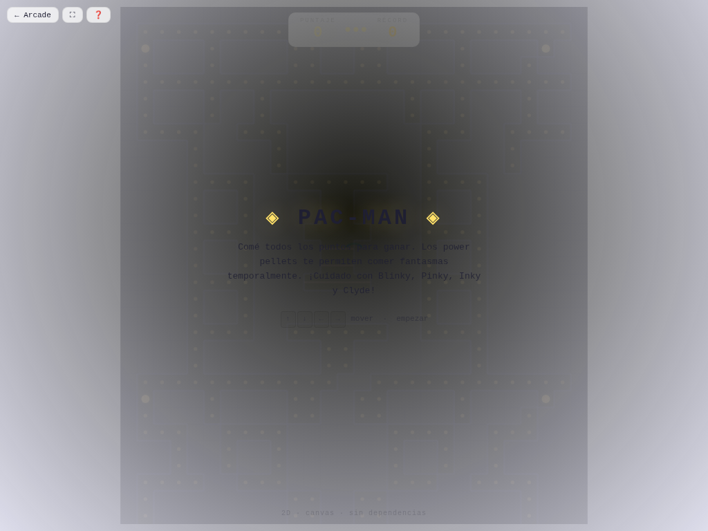

# 🟡 Pac-Man

**Versión:** 1.4.0 | **Género:** Laberinto | **Última actualización:** 2026-07-30

Comé todos los puntos del laberinto esquivando a los fantasmas. Power pellets te dejan comer fantasmas. ¡4 IAs distintas!

## Captura

## Controles

| Dispositivo | Acción                        | Tecla / Control |
| ----------- | ----------------------------- | --------------- |
| ⌨️ Teclado  | Mover arriba                  | `↑` / `W`       |
| ⌨️ Teclado  | Mover abajo                   | `↓` / `S`       |
| ⌨️ Teclado  | Mover izquierda               | `←` / `A`       |
| ⌨️ Teclado  | Mover derecha                 | `→` / `D`       |
| ⌨️ Teclado  | Empezar / Reiniciar           | `Espacio` / `R` |
| 🎮 Gamepad  | Movimiento                    | D-pad / Stick   |
| 👆 Táctil   | D-pad direccional en pantalla |                 |

## Características

- 👻 4 fantasmas con IA individual: Blinky (persecución), Pinky (emboscada), Inky (aleatorio), Clyde (tímido)
- 🟡 Power pellets para comer fantasmas
- 💥 Game feel: screen shake, hit-stop, partículas neon al comer fantasmas y puntos
- 🏆 Récord persistido en `localStorage`
- ♿ Accesibilidad: anuncios `aria-live`, prefers-reduced-motion
- 🎮 Soporte para teclado, táctil y gamepad

## Detalles técnicos

- Canvas 2D sin dependencias externas
- Game loop con `shared/loop.js` (`createGameLoop` con RAF + dt + cleanup)
- Canvas responsive con `shared/display.js` (`setupCanvas` con DPR + letterboxing + resize debounce)
- HTML compartido inyectado vía `shared/dom.js` (`injectCommonElements`)
- Estilos neon desde `shared/base.css` (overlay, HUD, touch controls, game bar, noise CRT)
- Audio sintetizado con `shared/audio.js` (Web Audio API: beep)
- Game feel: screen shake por trauma, hit-stop, squash & stretch, partículas con object pool (500), `feedbackBundle` por tiers
- Rendimiento: glow sin `shadowBlur` (`drawGlow`), object pooling
- Accesibilidad: `aria-live` announcements, prefers-reduced-motion → `setShakeScale(0)`
- Persistencia en `localStorage` con key namespaced
- 3 modos de entrada: teclado (flechas/WASD + Espacio + R), táctil (d-pad responsive), gamepad (polling en loop)
