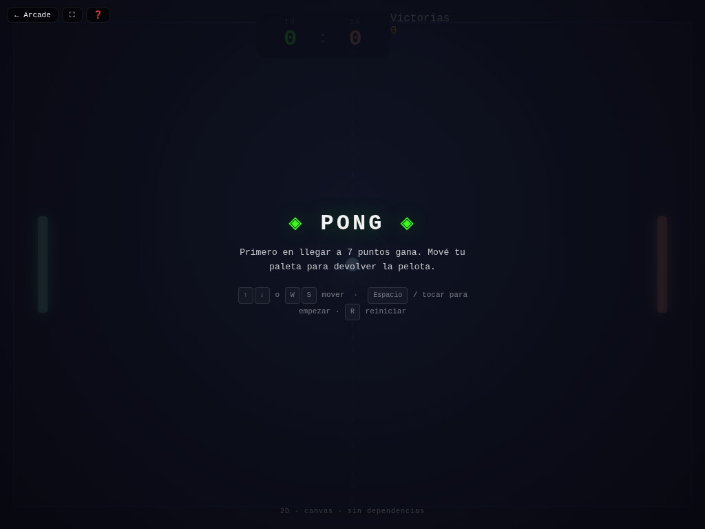

# 🏓 Pong

**Versión:** 1.1.0 | **Género:** Deportes | **Última actualización:** 2026-07-28

El clásico de tenis de mesa recreado en canvas 2D. Primero en llegar a 7 puntos gana.

## Captura

## Controles

| Dispositivo | Acción | Tecla / Control |
|-------------|--------|-----------------|
| ⌨️ Teclado | Mover arriba | `↑` / `W` |
| ⌨️ Teclado | Mover abajo | `↓` / `S` |
| ⌨️ Teclado | Empezar / Sacar | `Espacio` / `Enter` |
| ⌨️ Teclado | Reiniciar | `R` |
| 🎮 Gamepad | Movimiento | Stick izquierdo / D-pad |
| 🎮 Gamepad | Acción | Botón A / Start |
| 👆 Táctil | Botones ▲ ▼ en pantalla (visible en móvil) | |

## Características

- 🎯 IA de la paleta rival con seguimiento progresivo
- 💥 Efectos de partículas al golpear la pelota y al anotar
- 📊 Contador de victorias persistido en `localStorage`
- 🔄 Screen shake en puntos importantes
- 🌓 Soporte de tema claro/oscuro
- 🎮 Soporte para teclado, táctil y gamepad

## Detalles técnicos

- Canvas 2D sin dependencias externas
- Física con sub-pasos anti-tunneling para la pelota
- Módulos compartidos: `audio.js`, `effects.js`, `achievements.js`
