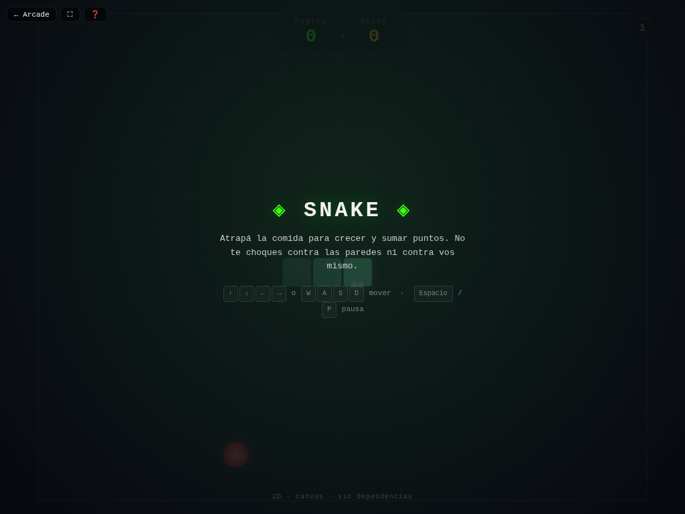

# 🐍 Snake

**Versión:** 1.1.0 | **Género:** Arcade | **Última actualización:** 2026-07-28

El clásico de la serpiente. Atrapá la comida para crecer y sumar puntos sin chocarte contra las paredes ni contra vos mismo.

## Captura

## Controles

| Dispositivo | Acción | Tecla / Control |
|-------------|--------|-----------------|
| ⌨️ Teclado | Mover arriba | `↑` / `W` |
| ⌨️ Teclado | Mover abajo | `↓` / `S` |
| ⌨️ Teclado | Mover izquierda | `←` / `A` |
| ⌨️ Teclado | Mover derecha | `→` / `D` |
| ⌨️ Teclado | Empezar / Pausa | `Espacio` |
| 🎮 Gamepad | Movimiento | D-pad / Stick izquierdo |
| 👆 Táctil | D-pad direccional en pantalla | |

## Características

- 🐍 Velocidad progresiva a medida que crecés
- 📊 Puntaje y récord persistido
- 💥 Animaciones y partículas al comer y al morir
- 🎮 Soporte para teclado, táctil y gamepad
