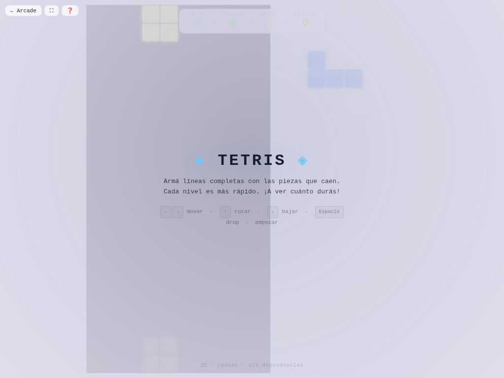

# 🧊 Tetris

**Versión:** 1.1.0 | **Género:** Puzzle | **Última actualización:** 2026-07-28

Armá líneas con las 7 piezas que caen. Rotación, ghost piece, niveles progresivos. ¡Clásico infinito!

## Captura

## Controles

| Dispositivo | Acción | Tecla / Control |
|-------------|--------|-----------------|
| ⌨️ Teclado | Mover izquierda | `←` / `A` |
| ⌨️ Teclado | Mover derecha | `→` / `D` |
| ⌨️ Teclado | Rotar | `↑` / `W` |
| ⌨️ Teclado | Caída rápida | `↓` / `S` |
| ⌨️ Teclado | Soltar (hard drop) | `Espacio` |
| ⌨️ Teclado | Pausa | `P` / `Escape` |
| 🎮 Gamepad | Mover / Rotar | D-pad + botones |
| 👆 Táctil | Botones en pantalla (← → rotar ⬇ soltar) | |

## Características

- 🟦 7 piezas clásicas (I, O, T, S, Z, J, L)
- 👻 Ghost piece que muestra dónde caerá la pieza
- ⚡ Niveles progresivos que aumentan la velocidad
- 🏆 Récord de líneas persistido en `localStorage`
- 🎮 Soporte para teclado, táctil y gamepad
